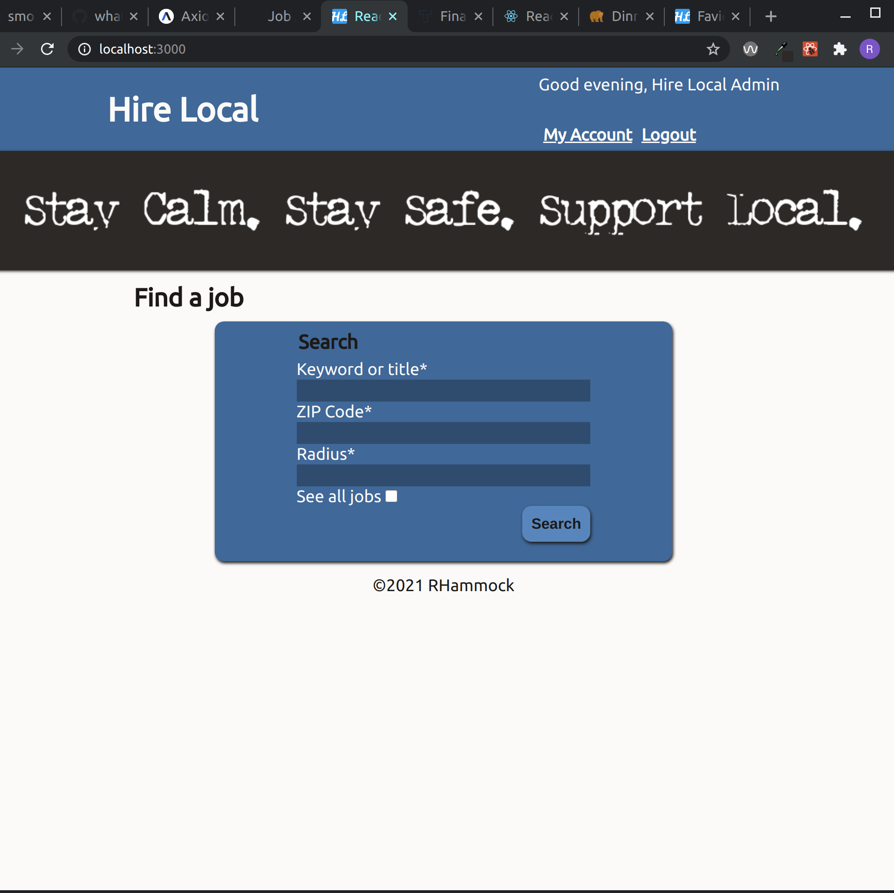
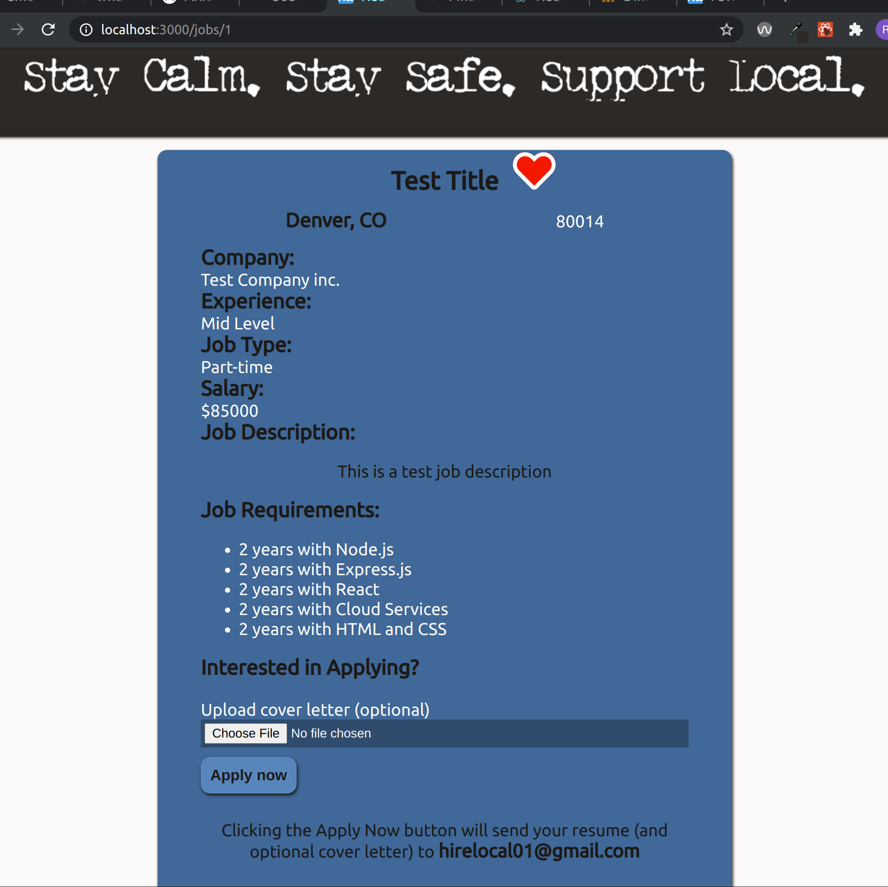
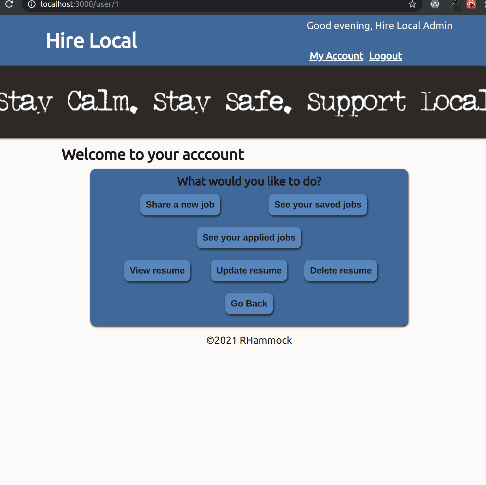
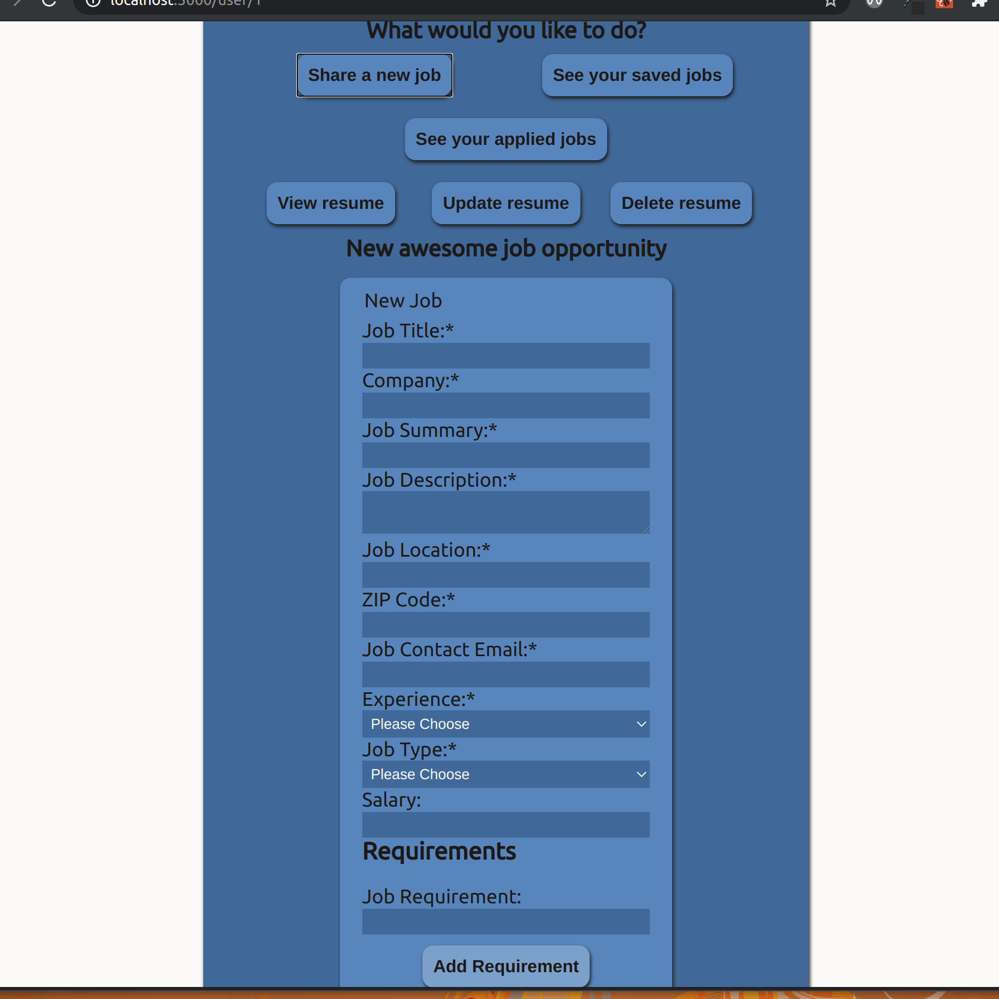
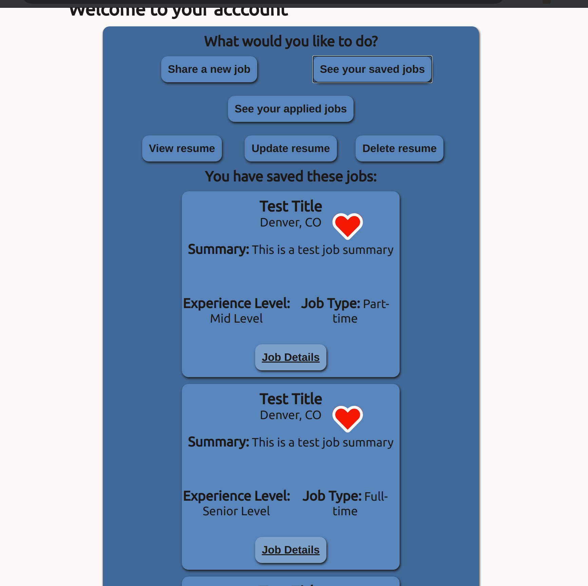

# Hire Local Client Capstone
Thinkful Third solo capstone

Uses SendGrid API and Zip-Codes API

Helps small and local businesses post jobs easily and reach local audiences. 

Users can sign up and login. They can upload a resume on sign up or in their account page. Their resume can be deleted, updated, and viewed from their account page.
Users can search for jobs by title, zipcode, and radius. Users can save jobs to view later and apply for the job from the detailed job view. 
When a user applies for a job an email is sent to the jobs contact with the user's resume and optional cover letter. The email is sent with SendGrid API
In their account page users can view their saves and applied jobs. 

### Live link is [here](https://hire-local-client.vercel.app/register)

Server Repo [here](https://github.com/rhammock1/hire-local-server)

### Stack Used: HTML, CSS, JavaScript React, Node.js, Express, PostgreSQL

## Screen Shots:

